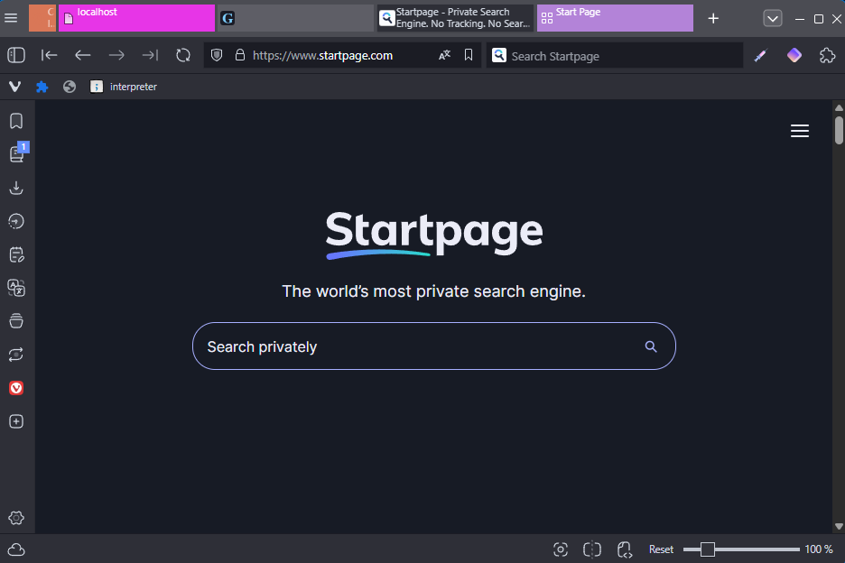
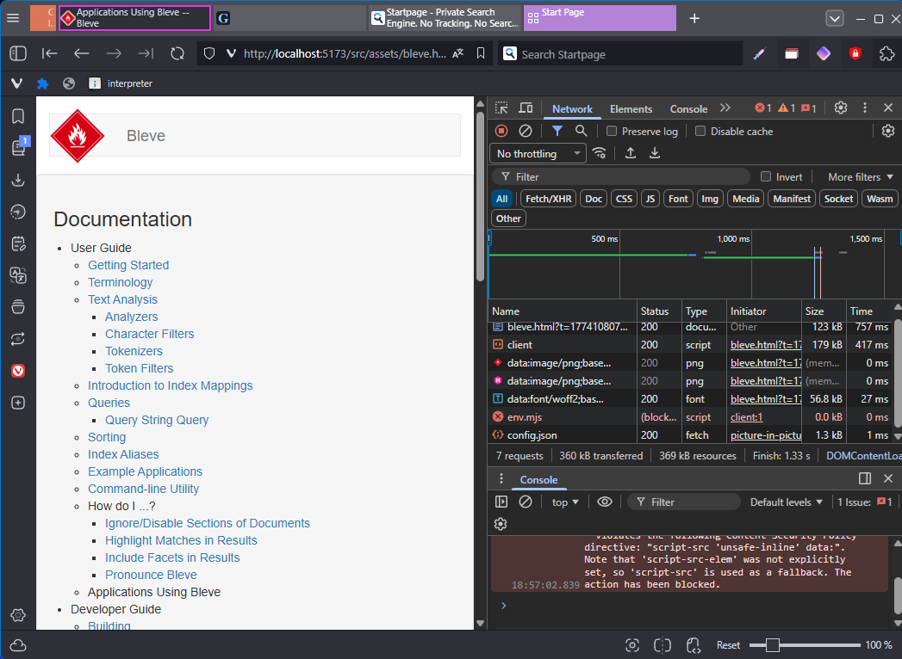
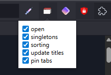

# Extension and modded Vivaldi

I am a full stack developer, so constantly in the browser. There are some nifty things able to be done to make it an optimized development experience.
Some (like the tab sorting) is provided in the extension part of this repository, but other features are enabled by extending the javascript of the index.html.

This is a repository for some personal 'hacks' I've done to vivaldi. This started from the idea I wanted certain tabs to only be present once. It grew from there with the other features.

Features extension:

- Having default tabs opened
- Automatic pinning of tabs
- Singleton tabs (to reduce duplication)
- Sorting protocol/urls
- Setting a custom tab title
- Enabling/disabling features using a popup

Features provided by injecting javascript:

- Colored tabs
- Opening devtools automatically on localhost sites

## Quick start

```cmd
npm install
npm run pack
```

Load unpacked extension in dist/extension

This automatically also injects javascript into the index.html

NOTE: A vivaldi update removes this, you need to rerun this script

## Feature showcases



- Colored tabs (orange, pink, purple)
- Having default tabs opened (claude)
- Automatic pinning of tabs (claude)
- Singleton tabs
- Sorting protocol/urls



- Open devtools on localhost sites (yes really, only vivaldi is able to do this!)



- Enabling/disabling features using a popup

## Development

### Debug CSS

First enable the custom CSS [here](vivaldi://experiments)
[Inspecting](vivaldi://inspect/#apps/) the Vivaldi UI with DevTools: https://forum.vivaldi.net/topic/16684/inspecting-the-vivaldi-ui-with-devtools

### Update the JS

Run the `dist/vivaldi/inject.cmd` to update the Javascript in Vivaldi and [restart](vivaldi://restart) your browser

## References

- The JS injection in browser came from [a forum post](https://forum.vivaldi.net/topic/10549/modding-vivaldi/2)
- The script.cmd mostly came from [a forum post](https://forum.vivaldi.net/topic/10592/patching-vivaldi-with-batch-scripts)

## Mouse shortcut

In vivaldi holding right mouse button and swiping left/right goes to next and previous window
